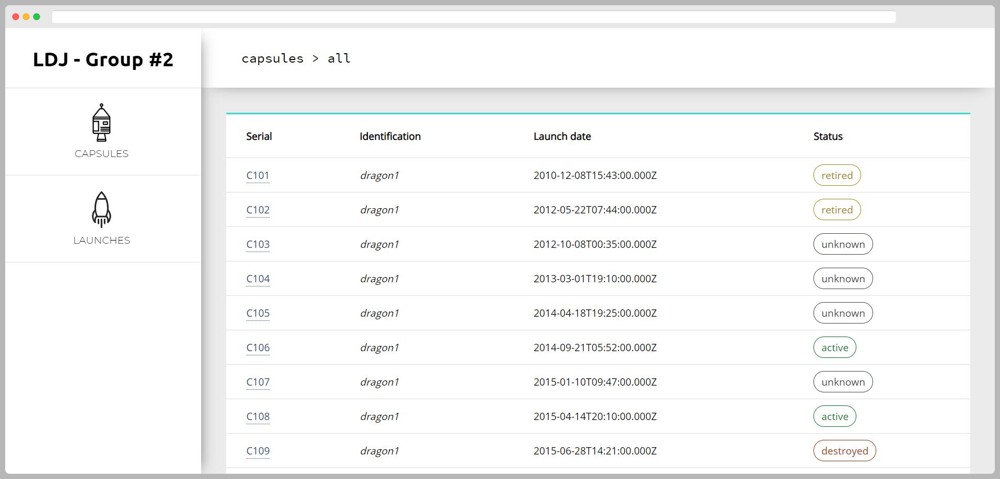

# About the project



This project is part of the 'Lead Development Java - Panorama des frameworks JavaScript' training. The main goal of the project is to create an Angular application which fetches and displays data from the [SpaceX API](https://docs.spacexdata.com/).

To view the full subject statement, click [here](https://gist.github.com/capywebformation/f1d8cf116bbafe5c216f8e0ef9869789).

# Getting started

## Pre-requisites 

You must have Docker installed on your computer before running the application. 

You can find more information about Docker [here](https://www.docker.com/get-started).

## Installation

1. Clone the repository
```
git clone https://github.com/BaCrs/LDJ-Groupe2.git
```

2. Launch the container
```
docker-compose up
``` 

3. Don't forget to stop the container
```
docker-compose down
``` 

# Contributing

Any contributions you make are greatly appreciated. Don't forget to follow our [Code of Conduct](.github/CODE_OF_CONDUCT.md).

# License

Distributed under the MIT License. See [LICENSE](LICENSE.md) for more information.